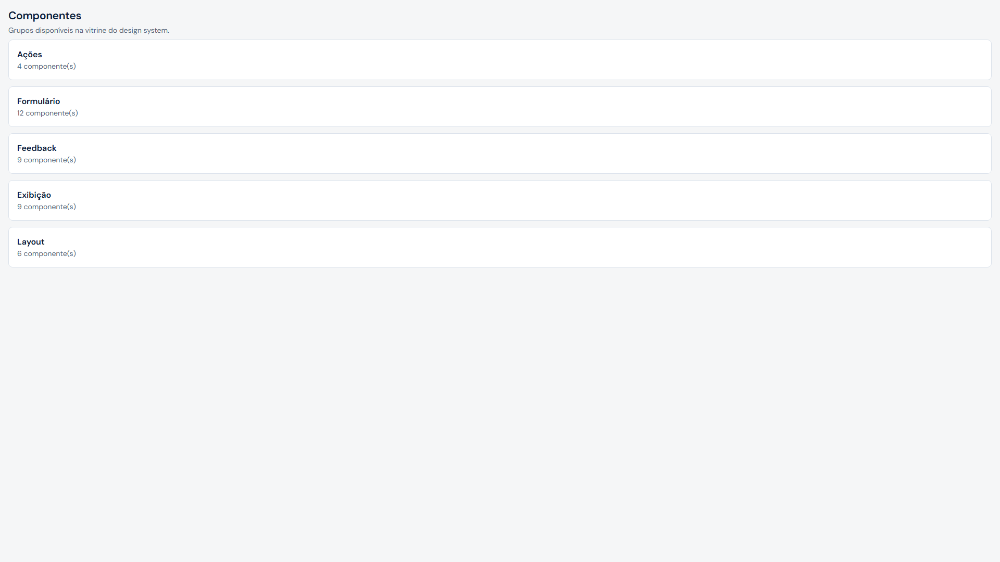
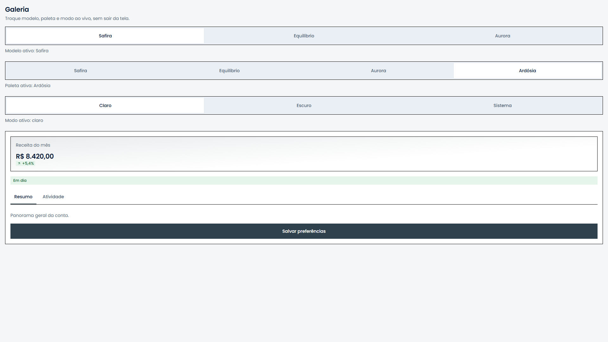

# Rendra App

**Design system e boilerplate mobile em React Native (Expo), com Expo Router e NativeWind, para todo app novo em português do Brasil.** Traz 44 componentes de UI prontos, 3 modelos de marca e 4 paletas, para quem precisa sair do zero com um app funcionando e trocar marca sem mexer em componente.


[](https://github.com/bsmagalhaes/rendra-app/actions/workflows/ci.yml)

## Veja funcionando, sem instalar nada

Vitrine publicada: [`https://bsmagalhaes.github.io/rendra-app/`](https://bsmagalhaes.github.io/rendra-app/) (atualizada a cada push em `main` com CI verde).

- [Componentes](https://bsmagalhaes.github.io/rendra-app/componentes) (41 entradas)
- [Tokens](https://bsmagalhaes.github.io/rendra-app/tokens) (paleta com AA ao vivo, tipografia, espaço, raio, sombra)
- [Galeria](https://bsmagalhaes.github.io/rendra-app/galeria) (troca ao vivo de modelo, paleta e modo pelo controle real)
- Exemplo com modelo e modo escolhidos por URL: [`/galeria?codigo=T3-C3&modo=escuro`](https://bsmagalhaes.github.io/rendra-app/galeria?codigo=T3-C3&modo=escuro)

## Prints de destaque

| | |
|---|---|
| [](https://bsmagalhaes.github.io/rendra-app/componentes) | [](https://bsmagalhaes.github.io/rendra-app/componentes) |

| | |
|---|---|
| [](https://bsmagalhaes.github.io/rendra-app/componentes) | [](https://bsmagalhaes.github.io/rendra-app/galeria) |

## O que é

Mesma finalidade do [Rendra web](https://github.com/bsmagalhaes/rendra-design-system): base para todo app novo, publicado sob licença MIT. Quem conhece o Rendra web reconhece aqui a mesma arquitetura de tokens em três camadas (modelo, paleta, sistema), os mesmos nomes de classe Tailwind, os mesmos nomes de componente e prop, e o mesmo fluxo de briefing para IA, sem tradução.

Critério de sucesso: trocar marca continua sendo 4 cores, degradê, modelo, nome e logotipo, sem mexer em componente.

## Galeria

Galeria completa, com troca ao vivo de modelo, paleta e modo pelo controle real: [`https://bsmagalhaes.github.io/rendra-app/galeria`](https://bsmagalhaes.github.io/rendra-app/galeria).

## Códigos de modelo e de componente

Cada combinação de modelo e paleta tem um código `T#-C#` (por exemplo, `T1-C1` é o modelo Safira com a paleta Safira; `T1-C4` é o modelo Safira com a paleta Ardósia). Os 3 modelos são `T1` Safira/Poppins, `T2` Equilíbrio/DM Sans e `T3` Aurora/Inter; as 4 paletas são `C1` Safira, `C2` Equilíbrio, `C3` Aurora e `C4` Ardósia. Cada componente e cada variante tem um código no formato `SIGLA-000` (por exemplo, `BTN-001` é o botão primário, `ABA-002` são as abas em pílula), igual em web e app: o catálogo é `src/catalog/components.ts`, com o selo do código ao lado do título de cada exemplo em [`/componentes`](https://bsmagalhaes.github.io/rendra-app/componentes).

## O que tem dentro

- Scaffold Expo Router + TypeScript estrito + NativeWind.
- Tokens de cor, tipografia, espaço, raio e sombra.
- 3 modelos prontos (Safira/Poppins, Equilíbrio/DM Sans, Aurora/Inter) e 4 paletas prontas (Safira, Equilíbrio, Aurora, Ardósia).
- `BrandProvider`/`useBrand`, com persistência local e troca em tempo de execução.
- `Gradient` em SVG.
- Os 44 componentes de UI (`src/components/ui`, `src/components/layout`), listados abaixo.
- `check:rules`, verificação estática das regras de `DESIGN_RULES.md`.
- Piso de cobertura (`coverageThreshold`): 90% em `src/lib`, 80% em `src/components` e `src/theme`, além do piso por arquivo nos módulos de contrato (`src/lib/masks.ts`, `src/lib/validators.ts`, `src/brand/palette.ts`, `src/theme/vars.ts`, `src/config/presets.ts`, `src/config/showcase.tsx`, `src/lib/robots.ts`, `src/lib/llms-txt.ts`, `src/config/seo.ts`).
- Rota `/componentes` (vitrine completa, 41 entradas), `/tokens` (paleta com AA ao vivo, tipografia, espaço, raio, sombra) e `/galeria` (troca ao vivo de modelo, paleta e modo pelo controle real).
- Export web com SEO por rota (título, description, canonical, Open Graph, `sitemap.xml`, `robots.txt`, `llms.txt`), testado por Playwright (layout e toque) e axe (WCAG 2.1 AA).
- CI (GitHub Actions), fluxo de IA e documentação completos.

### Os 44 componentes de UI (disponíveis)

- **Ações (4):** Button, ButtonGroup, ActionBar, DropdownMenu.
- **Formulário (14):** Input, Textarea, Select, Checkbox, CheckboxGroup, RadioGroup, Switch, Slider, OtpInput, DatePicker, Field, Form, FormField, FormSection.
- **Feedback (10):** BrandFeedbackIcon, Alert, Toast, Progress, Skeleton, Spinner, EmptyState, InfoHint, Modal, Drawer.
- **Exibição (10):** Card, Badge, Avatar, AvatarGroup, List, StatCard, Accordion, Tabs, Separator, BrandLogo.
- **Layout (6):** Container, Stack, Inline, Grid, Section, PageHeader.

A vitrine em `/componentes` mostra 41 entradas reais (Ações 4, Formulário 12, Feedback 10, Exibição 9,
Layout 6): `FormField`/`FormSection` entram compostos nos exemplos de `Form`, e `'Select (lista
longa)'` conta como entrada própria (decisão do fechamento da F1b), por isso a contagem da vitrine
difere da contagem por exportação acima.

## Stack

- React Native 0.86, Expo SDK 57, Expo Router (roteamento por arquivo, export estático)
- NativeWind 4.2 (Tailwind para React Native)
- TypeScript 6, modo estrito
- Jest 29 + jest-expo + React Native Testing Library 14
- Playwright 1.63 + axe-core (WCAG 2.1 AA)

## Começar com IA

Cole o link deste repositório numa IA de código (Claude Code, Codex, Cursor, Gemini, Copilot) e diga o que quer em uma frase: `AGENTS.md` é o ponto único de entrada, lido primeiro por qualquer uma delas. Os demais arquivos abaixo só resumem e apontam para ele, com o mesmo conteúdo:

**Projeto novo**, cole:

```text
Clone https://github.com/bsmagalhaes/rendra-app e use como base do meu novo app. Siga o AGENTS.md do repositório.
```

**Migração de um app existente**, abra a IA na pasta do seu app e cole:

```text
Aplique neste app o design system https://github.com/bsmagalhaes/rendra-app. Leia, nesta ordem: https://github.com/bsmagalhaes/rendra-app/blob/main/AGENTS.md, https://github.com/bsmagalhaes/rendra-app/blob/main/DESIGN_RULES.md, https://github.com/bsmagalhaes/rendra-app/blob/main/docs/PROMPT_MIGRACAO.md e https://github.com/bsmagalhaes/rendra-app/blob/main/docs/COMO_APLICAR.md, e siga o fluxo de migração, começando pelo briefing.
```

O prompt completo (`docs/PROMPT_MIGRACAO.md`) escolhe entre pacote npm, cópia dos arquivos ou refazer do zero, por um critério simples, e recomenda um caminho em vez de perguntar qual dos três; abaixo do piso real dos componentes animados (React Native 0.83 ou mais recente, pela Reanimated 4), o mesmo documento explica se atualizar o React Native primeiro ou refazer.

| Arquivo | Ferramenta |
|---|---|
| `AGENTS.md` | Ponto de entrada (todas as IAs) |
| `CLAUDE.md` | Claude Code |
| `GEMINI.md` | Gemini |
| `.github/copilot-instructions.md` | GitHub Copilot |
| `.cursor/rules/rendra.mdc` | Cursor |
| `.windsurfrules` | Windsurf |

`.claude/settings.json` (plugin `expo` do Claude Code) não está versionado: é conveniência opcional de quem já usa o Claude Code, não faz parte do fluxo obrigatório.

## Como rodar

Node 22 ou mais recente (`engines` do `package.json`; o CI usa o 24).

```bash
npm install
npm start
```

```bash
npx expo start
```

Abre o Metro (dev server) e imprime um QR code no terminal. Se a porta padrão (`8081`) já estiver
ocupada (por exemplo, por um container Docker), passe outra porta:

```bash
npx expo start --port 8090
```

As rotas do app ficam na raiz do dev server, sem o prefixo `/rendra-app` (esse prefixo
só existe no export estático publicado no GitHub Pages, ver abaixo): com o Metro em `8090`,
`/tokens` e `/galeria` abrem em `http://localhost:8090/tokens` e `http://localhost:8090/galeria`.

- **Celular físico, com Expo Go:** escaneie o QR code impresso no terminal. Se o celular não
  conseguir conectar (rede corporativa, VPN, ou celular numa rede Wi-Fi diferente da do
  computador), rode com túnel: `npx expo start --tunnel`.
- **Emulador Android:** `npx expo start --android` abre o app direto num emulador já em execução
  (ou inicia um, se o Android Studio tiver um AVD configurado). Exige a variável de ambiente
  `ANDROID_HOME` apontando para o SDK do Android (`%LOCALAPPDATA%\Android\Sdk` no Windows por
  padrão) e o emulador/`adb` no `PATH`.
- **Navegador:** `npx expo start --web`, ou pressione `w` no terminal do Metro depois de
  `npx expo start`.

Export estático (o que a vitrine publicada e os testes Playwright usam) leva o prefixo
`/rendra-app/` em todo link e asset, configurado em `experiments.baseUrl` de
`app.json`; é só o `expo export --platform web` (via `npm run build`) que aplica esse prefixo,
não o dev server do Metro.

```bash
npm run typecheck      # tsc --noEmit
npm run lint           # expo lint
npm run check:rules    # R1-R15, mais a checagem de CLAUDE.md
npm run test:coverage  # Jest + jest-expo + RNTL
npm run build          # expo export --platform web (alias: build:web)
npm run build:lib      # tsc -p tsconfig.lib.json + cabeçalho de autoria (dist-lib/)
npm run verify:pack    # npm pack real, instala num projeto temporário, renderiza um componente
npm run test:layout    # Playwright, layout e toque
npm run test:a11y      # Playwright + axe, WCAG 2.1 AA
npm run docs:images    # capturas do README e og-image.png (rode npm run build antes)
```

## Formas de uso e comandos

### Clone (boilerplate)

Para começar um app novo a partir deste repositório.

```bash
git clone https://github.com/bsmagalhaes/rendra-app.git meu-app
cd meu-app
npm install
npm run clean:clone -- --nome meu-app
npm start
```

### Pacote npm

Para usar os componentes num app que já existe, sem copiar arquivos.

```bash
npm install @rendra-ui/app nativewind tailwindcss@3
npx expo install react react-native react-native-reanimated react-native-gesture-handler react-native-safe-area-context react-native-svg @react-native-async-storage/async-storage expo-status-bar
```

```ts
import { BrandProvider, Button, registerIconInterop } from '@rendra-ui/app'
import { RendraRouterBridge } from '@rendra-ui/app/router-bridge'
```

O pacote e o Tailwind pelo `npm install` comum, fixando `tailwindcss@3` (a `latest` é a 4, fora da faixa que a NativeWind suporta); os peers nativos pelo `npx expo install`, que escolhe a versão que o SDK do app empacota, em vez da versão mais nova do npm. `tailwind.config.js` com `presets: [require('@rendra-ui/app/tailwind-preset')]` e `content` incluindo `./node_modules/@rendra-ui/app/dist-lib/**/*.js`; `babel.config.js`/`metro.config.js` com NativeWind; `registerIconInterop()` e `<BrandProvider>` na raiz; `<RendraRouterBridge>` (Expo Router) ou um `RendraNavigationProvider` próprio. Componentes com `useAnimatedStyle` (`Button`, entre outros) exigem o plugin `react-native-worklets/plugin` no Babel: em app Expo, `babel-preset-expo` já inclui esse plugin sozinho; em bare React Native sem esse preset, acrescente à mão. Passo a passo completo em `docs/COMO_APLICAR.md`, seção "Pelo pacote npm".

Registry, CLI e skill: não existem no app; ver `CHANGELOG.md`.

## Estrutura

```
app/                 # Expo Router (file-based)
  _layout.tsx         # SafeAreaProvider, GestureHandlerRootView, BrandProvider
  +html.tsx           # modelo raiz do export estático (lang, metas de política, reset de layout)
  index.tsx            # redireciona para /componentes
  componentes/         # vitrine (grupos, [slug])
  tokens/index.tsx     # paleta, tipografia, espaço, raio, sombra, pares AA ao vivo
  galeria/index.tsx    # troca ao vivo de modelo/paleta/modo pelo controle real
src/
  index.ts             # entrada principal do pacote @rendra-ui/app
  router-bridge.tsx    # subcaminho ./router-bridge, único ponto com expo-router
  navigation/           # contexto de navegação sem roteador (RendraNavigationProvider)
  brand/               # BrandProvider, useBrand, palette.ts, palettes.ts (4 paletas prontas)
  theme/               # tokens.ts, models.ts, vars.ts, fonts.ts, tailwind-preset.ts
  components/
    internal/           # Text base, primitivas internas
    gradient/            # <Gradient token="brand|soft|accent" />
    ui/                  # os 44 componentes de UI
    layout/              # Container, Stack, Inline, Grid, Section, PageHeader
  hooks/               # useControlledState, useLookup, usePlaceholderColor
  lib/                 # cn, masks, validators, shape, a11y, robots, llms-txt
  config/              # presets.ts (parseModelCode/formatModelCode), showcase.tsx (vitrine), seo.ts
scripts/
  check-rules.ts        # R1-R15 (ts-morph) + checagem de CLAUDE.md
  seo-build.ts          # title/description/og por rota, sitemap, robots.txt, llms.txt, 404
  readme-images.ts       # capturas do README e og-image.png, por script
  verify-pack.ts        # npm pack real, instala num projeto temporário, renderiza um componente
  clean-clone.ts        # troca a identidade de pacote do Rendra pela do projeto clonado
tsconfig.lib.json       # tsconfig do build:lib (dist-lib/)
e2e/                   # Playwright (layout e acessibilidade)
```

## Como trocar a marca

Trocar marca é sempre: 4 cores, degradê, modelo, nome e logotipo, nunca componente. Resumo (guia completo em `docs/COMO_APLICAR.md`):

1. Defina as 4 cores e o degradê (`PaletteSeeds`), e gere a paleta com `createPalette` (`src/brand/palette.ts`), que deriva o resto por contraste (AA garantido).
2. Escolha o modelo (fonte e formato de raio): `T1` Safira, `T2` Equilíbrio, `T3` Aurora, ou um modelo próprio em `src/theme/models.ts`.
3. Aplique em runtime com `useBrand()` (`applyPalette`, `setPaletteId`, `setModelCode`, `setMode`), sem recarregar o app.
4. Defina o nome do produto em `BrandConfig.productName` (`src/brand/types.ts`).
5. Logotipo é opcional: sem `symbol`/`logo`, o `BrandLogo` usa um símbolo genérico interno.

## Documentação

- `AGENTS.md`: fluxo de trabalho para assistentes de IA.
- `DESIGN_RULES.md`: regras de design e `check:rules`.
- `docs/BRIEFING_MODELO.md`: modelo de briefing para quem usar este boilerplate.
- `docs/COMO_APLICAR.md`: como trocar marca sem mexer em componente.
- `docs/PROMPT_MIGRACAO.md`: prompt para migrar um app existente para este design system.
- `CONTRIBUTING.md`, `CHANGELOG.md`.
- Design system web (referência pública): [`https://github.com/bsmagalhaes/rendra-design-system`](https://github.com/bsmagalhaes/rendra-design-system).

## Perguntas frequentes

**O que é o Rendra App?** Um design system e boilerplate mobile (React Native/Expo), espelho do Rendra web, com os mesmos tokens, nomes de componente e fluxo de marca.

**Preciso do Rendra web para usar o app?** Não. O app é independente: nenhum arquivo dele importa ou referencia caminho local do web, só cita a URL pública dele como referência.

**Como troco a marca?** 4 cores, degradê, modelo, nome e logotipo, sem mexer em componente. Ver "Como trocar a marca" acima e `docs/COMO_APLICAR.md`.

**O app roda no navegador?** Sim, via `expo export --platform web` (export estático, é o que a vitrine publicada usa) ou `npx expo start --web` em desenvolvimento.

**Qual a licença? Preciso manter o crédito "Feito com Rendra"?** MIT. O crédito na interface é opcional e pode ser removido, mas a licença MIT sempre exige manter o aviso de copyright e o arquivo `LICENSE`.

**Este projeto vira um pacote npm instalável?** Sim, e já está publicado: `npm install @rendra-ui/app` (ver "Formas de uso e comandos" acima). A primeira publicação saiu na versão 0.3.0; a tag `v1.0.0` e o `npm publish` desta versão continuam manuais, num terminal interativo do autor (padrão dos produtos Rendra, seção 1, item 5).

**Uso outro roteador, e agora?** Sem Expo Router, forneça seu próprio `RendraNavigationProvider` (de `@rendra-ui/app`) alimentado pelas funções de navegação do seu roteador, em vez do `RendraRouterBridge` (que é específico do Expo Router).

**Preciso do NativeWind no meu app?** Sim, é peer obrigatório: os componentes usam classes Tailwind resolvidas em tempo de execução pelo NativeWind (`className`), não há alternativa sem ele.

## Autor

Criado e mantido por **Bruno Magalhaes**.

- Site: [www.brunomagalhaes.me](https://www.brunomagalhaes.me)
- E-mail: [contato@brunomagalhaes.me](mailto:contato@brunomagalhaes.me)
- Instagram: [@brunomagalhaes.me](https://www.instagram.com/brunomagalhaes.me/)

## Licença

[MIT](LICENSE) © 2026 Bruno Magalhaes. Pode usar, copiar, alterar e distribuir, inclusive em projetos comerciais, mantendo o aviso de copyright.

## Créditos

Construído com [Expo](https://expo.dev/), [Expo Router](https://docs.expo.dev/router/introduction/), [NativeWind](https://www.nativewind.dev/), [React Native Reanimated](https://docs.swmansion.com/react-native-reanimated/), [React Native Gesture Handler](https://docs.swmansion.com/react-native-gesture-handler/), [React Native Safe Area Context](https://github.com/th3rdwave/react-native-safe-area-context), [react-native-svg](https://github.com/software-mansion/react-native-svg), [Lucide](https://lucide.dev/), [React Hook Form](https://react-hook-form.com/), [Zod](https://zod.dev/), [IMask](https://imask.js.org/), [date-fns](https://date-fns.org/), [Jest](https://jestjs.io/), [React Native Testing Library](https://callstack.github.io/react-native-testing-library/) e [Playwright](https://playwright.dev/) (com [axe-core](https://github.com/dequelabs/axe-core)). Fontes Poppins, Inter e DM Sans, sob licença SIL Open Font License.
